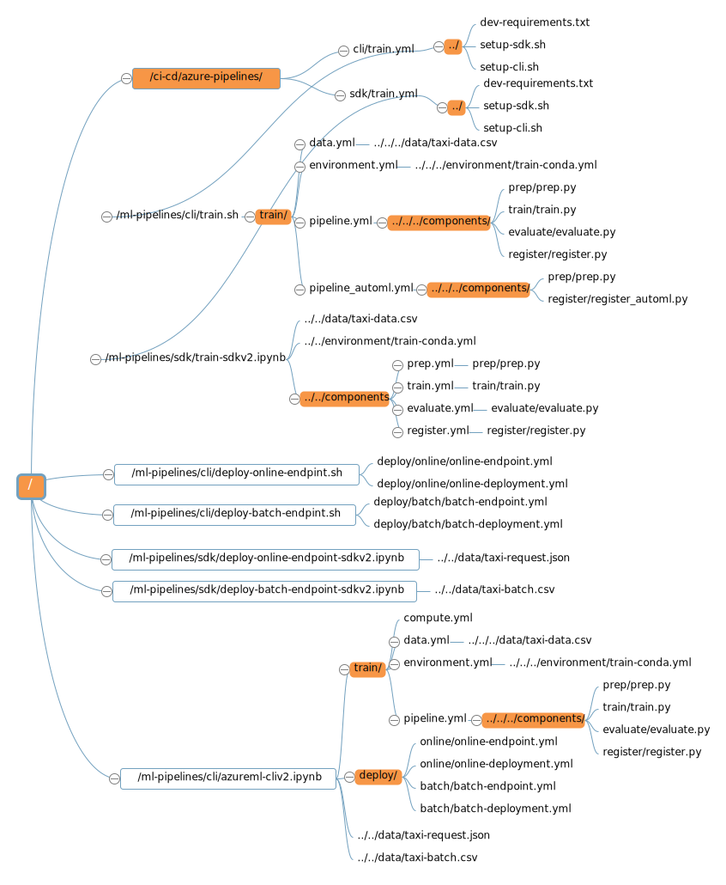
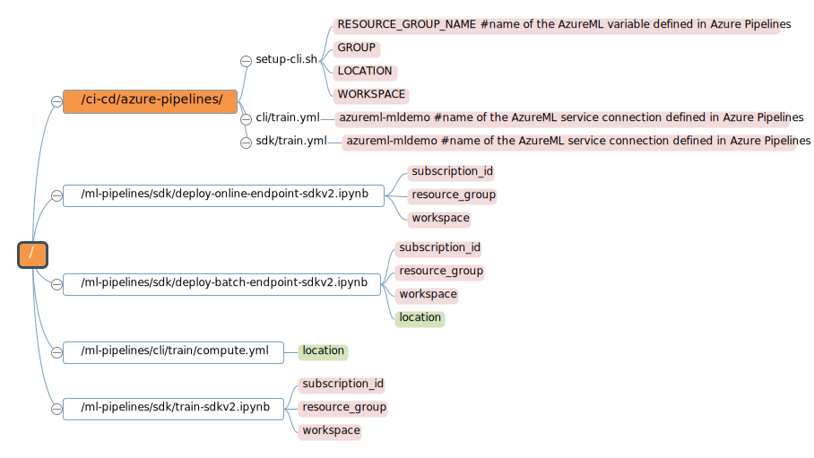

# Azure MLOps (v2) Training

This training demo is inspired by the [MLOps v2 solution accelerator](https://github.com/Azure/mlops-v2). For this demo, we will be using the classical use case (Tabular data), Azure Machine Learning CLI v2 or SDK v2 for model training and deployment, and Azure Devops for CI/CD.

## Repo structure

```bash
|-- ci-cd                                        #
|   |-- azure-pipelines                          #
|   |   |-- cli                                  #
|   |   |   |-- train.yml                        # Yaml configuration of Azure Devops pipeline that performs the training workflow with cliv2
|   |   |-- sdk                                  #
|   |   |   |-- train.yml                        # Yaml configuration of Azure Devops pipeline that performs the training workflow with sdkv2
|   |   |-- dev-requirements.txt                 # Python package requirement needed to execute python scripts in Azure Pipeline
|   |   |-- setup-cli.sh                         # Setup cliv2 in Azure Pipeline
|   |   |-- setup-sdk.sh                         # Setup sdkv2 in Azure Pipeline
|   |-- images                                   # Image folder including images used in README.md file in the same folder
|   |-- README.md                                # README.md file for the ci-cd in Azure Pipeline
|-- components                                   #
|   |-- evaluate                                 #
|   |   |-- evaluate.py                          # Python script that reads test data and trained model and evaluates model performance
|   |-- prep                                     #
|   |   |-- prep.py                              # Python script that reads raw data and prepare train, val and test datasets
|   |-- register                                 #
|   |   |-- register.py                          # Python script that register trained model in AzureML Model Registry
|   |   |-- register_automl.py                   # Python script that register automl trained model in AzureML Model Registry
|   |-- train                                    #
|   |   |-- train.py                             # Python script that reads train data, trains and saves an ML model
|   |-- evaluate.yml                             # AzureML Component definition for 'evaluate.py'
|   |-- prep.yml                                 # AzureML Component definition for 'prep.py'
|   |-- register.yml                             # AzureML Component definition for 'register.py'
|   |-- train.yml                                # AzureML Component definition for 'train.py'
|-- data                                         #
|   |-- taxi-batch.csv                           # Data used for testing batch endpoint
|   |-- taxi-data.csv                            # Data used for training & testing ML model
|   |-- taxi-request.json                        # Data used for testing online endpoint
|-- environment                                  #
|   |-- train-conda.yml                          # Environment conda specification needed to execute python scripts in ML workload
|   |-- train-requirements.txt                   # Python package requirement needed to execute python scripts in ML workload
|-- imgs                                         # Image folder including images used in the notebooks in this repository
|-- ml-pipelines                                 #
|   |-- cli                                      #
|   |   |-- deploy                               #
|   |   |   |-- batch                            #
|   |   |   |   |-- batch-deployment.yml         # AzureML yaml configuration of AzureML batch deployment
|   |   |   |   |-- batch-endpoint.yml           # AzureML yaml configuration of AzureML batch endpoint
|   |   |   |-- online                           #
|   |   |       |-- online-deployment.yml        # AzureML yaml configuration of AzureML online deployment
|   |   |       |-- online-endpoint.yml          # AzureML yaml configuration of AzureML online endpoint
|   |   |-- train                                #
|   |   |   |-- compute.yml                      # Yaml configuration of AzureML training compute cluster
|   |   |   |-- data.yml                         # Yaml configuration of AzureML training (input) data asset
|   |   |   |-- environment.yml                  # AzureML yaml configuration of training environment
|   |   |   |-- pipeline.yml                     # AzureML yaml configuration of training pipeline
|   |   |   |-- pipeline_automl.yml              # AzureML yaml configuration of training pipeline for automl
|   |   |-- azureml-cliv2.ipynb                  # A notebook to execute training & deployment workflows with cliv2
|   |   |-- deploy-batch-endpint.sh              # Shell script that performs the batch endpoint deployment with cliv2 in AzureDevops pipeline
|   |   |-- deploy-online-endpint.sh             # Shell script that performs the online endpoint deployment with cliv2 in AzureDevops pipeline
|   |   |-- train.sh                             # Shell script that performs the training workflow with cliv2 in AzureDevops pipeline
|   |-- sdk                                      #
|       |-- deploy-batch-endpoint-sdkv2.ipynb    # A notebook to execute the batch endpoint deployment with sdkv2 in AzureDevops pipeline
|       |-- deploy-online-endpoint-sdkv2.ipynb   # A notebook to execute the online endpoint deployment with sdkv2 in AzureDevops pipeline
|       |-- train-sdkv2.ipynb                    # A notebook to execute the training workflow with sdkv2 in AzureDevops pipeline
|-- README.md                                    # README.md file for the repo
```

## Getting Started with MLOps (v2) training

In order to execute the training, you can follow the following guide:

1- Understand the data science use case: Go to `ml-pipelines/`, execute and understand the ML workflow done in the notebooks: `cli/azureml-cliv2.ipynb`, `sdk/train-sdkv2.ipynb`, `sdk/deploy-online-endpoint-sdkv2.ipynb` and `sdk/deploy-batch-endpoint-sdkv2.ipynb`.

2- Notebooks can't be used in production. Notebooks are usually refactored into python scripts: Go to `components` and check out the corresponding python scripts of the same ML workflow: `prep.py`, `train.py`, `evaluate.py` and `register.py`.

Pay attention to the input and output arguments of these scripts and how are they used. When it comes to arguments, think about variables that need to change from one execution to another.

3- The objective of the CI/CD pipelines available in `ci-cd/azure-pipelines` is to automate the model training process using CI/CD Azure Devops pipelines.

In this CI/CD pipeline, we only consider the model training parts and do not add the deployment parts. You can add them as needed to call the deployment parts.

## References

### File Call Relationship

The following is a file call relationship diagram of this repository. The orange parts represent the folders.


### Parameters

The following diagram is about the required parameters that you are advised to set or modify in this repository. The orange part represents the folders. The pink parameters need to be checked, set or modified. The green parameters are optional but recommended to change to an appropriate location.


In the repository, there are still many given parameters or names that can be defined or modified as needed.
